# NextQuark — System Design Documentation

> AI-powered automated job application platform with an admin dashboard for monitoring and controlling AI agents that autonomously fill and submit job applications across ATS portals.

---

## Table of Contents

1. [High-Level Architecture](#1-high-level-architecture)
2. [Frontend Layer](#2-frontend-layer)
3. [API Layer](#3-api-layer)
4. [Automation Engine](#4-automation-engine)
5. [Database Schema](#5-database-schema)
6. [Email System](#6-email-system)
7. [External Integrations](#7-external-integrations)
8. [Key Design Patterns](#8-key-design-patterns)
9. [Data Flow Diagrams](#9-data-flow-diagrams)

---

## 1. High-Level Architecture

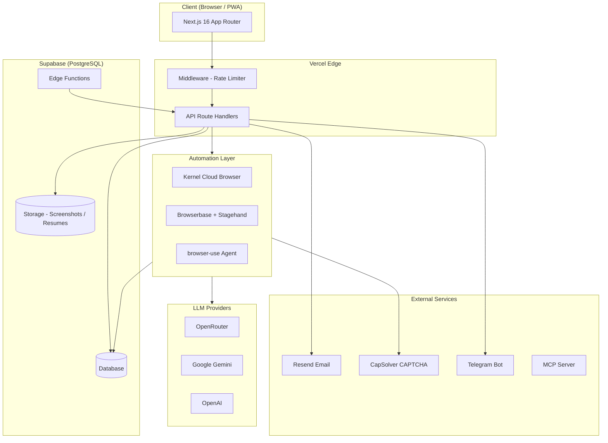

---

## 2. Frontend Layer

**Stack:** React 19, Next.js 16 App Router, TypeScript, Tailwind CSS v4, shadcn/ui (Radix UI), SWR

**PWA:** Service worker + web manifest, installable on mobile/desktop

**Deployment:** Vercel with `@vercel/analytics`

### Pages

| Route | Component | Purpose |
|---|---|---|
| `/` | `overview-screen.tsx` | Dashboard with stats, charts, recent activity |
| `/queue` | `queue-screen.tsx` | Live application queue with real-time updates |
| `/users` | `users-screen.tsx` | User profile management |
| `/companies` | `companies-screen.tsx` | Company + ATS portal config |
| `/jobs` | `jobs-screen.tsx` | Job listings with right-swipe tracking |
| `/agents` | `agents-screen.tsx` | AI agent status and configuration |
| `/analytics` | `analytics-screen.tsx` | Charts and performance metrics |
| `/emails` | `emails-screen.tsx` | Email campaign manager |
| `/otp-manager` | `otp-manager-screen.tsx` | OTP inbox viewer |
| `/logs` | `logs-screen.tsx` | Application run logs |
| `/pricing` | `pricing-screen.tsx` | Pricing management |
| `/settings` | `settings-screen.tsx` | API keys, provider toggle |

### State Management

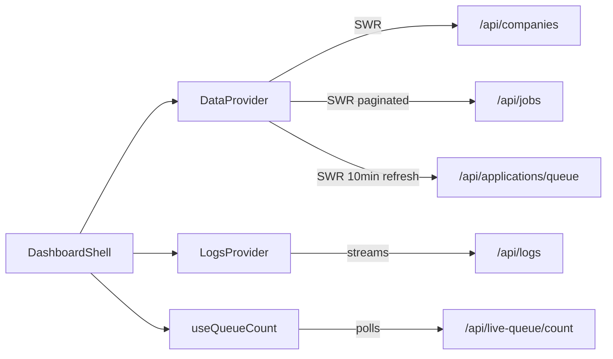

---

## 3. API Layer

All routes are Next.js Route Handlers under `/app/api/`. Rate-limited by `middleware.ts` via `lib/rate-limit.ts`.

### Core Data APIs

| Method | Endpoint | Description |
|---|---|---|
| GET/POST | `/api/companies` | List all companies / create company |
| GET/PATCH | `/api/jobs` | List jobs (paginated) / update job |
| POST | `/api/jobs` | Create job |
| GET | `/api/users` | List users |
| GET/PATCH/DELETE | `/api/users/[id]` | Get / update / delete user |
| GET | `/api/applications/queue` | List application queue |
| GET/PATCH | `/api/applications/[id]` | Get / update application |
| GET | `/api/applications/progress` | Application progress stream |

### Automation APIs

| Method | Endpoint | Description |
|---|---|---|
| POST | `/api/auto-apply` | Trigger agent run for one application (supports SSE streaming) |
| POST | `/api/auto-apply-queue` | Batch dispatch from queue |
| GET | `/api/live-queue` | Get live queue entries |
| GET | `/api/live-queue/count` | Get pending count (used by sidebar badge) |

### ATS Sync APIs

| Method | Endpoint | Description |
|---|---|---|
| POST | `/api/ats-sync` | Sync jobs for one company |
| POST | `/api/ats-sync-all` | Sync all companies |
| POST | `/api/sync-jobs` | Manual job sync trigger |
| POST | `/api/backfill-jobs` | Backfill missing job data |
| POST | `/api/cleanup-jobs` | Remove stale/expired jobs |

### Cron APIs (called by Vercel Cron / pg_cron)

| Method | Endpoint | Description |
|---|---|---|
| GET | `/api/cron/schedule-sync` | Schedule ATS sync jobs |
| GET | `/api/cron/process-sync` | Process pending sync queue |
| GET | `/api/cron/cleanup-rejected` | Purge old rejected applications |
| GET | `/api/cron/job-summary` | Send daily summary emails |
| GET | `/api/cron/watchdog` | Health watchdog |

### Email APIs

| Method | Endpoint | Description |
|---|---|---|
| POST | `/api/email/broadcast` | Send broadcast campaign |
| POST | `/api/email/milestone` | Send milestone email |
| POST | `/api/email/rejection` | Send rejection notification |
| POST | `/api/email/inactivity` | Send inactivity nudge |
| POST | `/api/email/complete-profile` | Send profile completion prompt |
| GET/POST | `/api/email/templates` | List / create email templates |
| GET | `/api/email/logs` | Email delivery logs |
| POST | `/api/email/test` | Send test email |

### Webhook APIs

| Method | Endpoint | Description |
|---|---|---|
| POST | `/api/webhooks/profile-created` | Supabase trigger on new user profile |
| POST | `/api/webhooks/resume-uploaded` | Triggers resume parsing pipeline |
| POST | `/api/webhooks/application-submitted` | Post-submission processing |
| POST | `/api/webhooks/resend` | Resend delivery event handler (Svix verified) |

### Utility APIs

| Method | Endpoint | Description |
|---|---|---|
| GET/POST | `/api/settings` | Read / write global settings (API keys, provider) |
| GET/POST | `/api/settings/env-key` | Manage environment key overrides |
| GET | `/api/otp-manager` | Read OTP codes from proxy inbox |
| POST | `/api/scraper` | Scrape job details from URL |
| GET | `/api/system-health` | System health check |
| GET | `/api/portal-health` | ATS portal health check |
| GET | `/api/overview` | Aggregated dashboard stats (30s cache) |
| GET | `/api/analytics` | Analytics data |
| GET | `/api/logs` | Application logs |
| GET/POST | `/api/answer-bank` | Answer bank CRUD |
| GET/POST | `/api/agents` | Agent list and stats |
| POST | `/api/agents/create` | Create agent config |
| GET/POST | `/api/agents/config` | Agent configuration |
| GET | `/api/agents/performance` | Agent performance metrics |
| GET | `/api/pricing` | Pricing data |
| POST | `/api/upload` | File upload (resumes) |
| POST | `/api/setup` | Initial setup |
| GET/POST | `/api/notifications` | Push notifications |
| GET/POST | `/api/mcp/[transport]` | MCP server endpoint |

### API Flow — Auto Apply

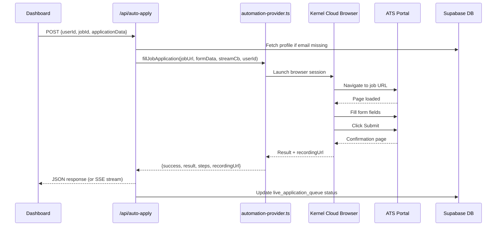

---

## 4. Automation Engine

The core is `lib/kernel.ts`. It orchestrates the entire browser automation pipeline for a single application run.

### Full Run Pipeline

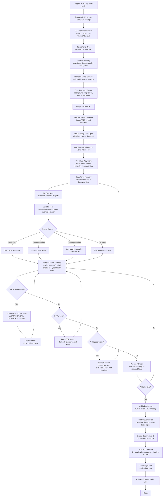

### LLM Chain

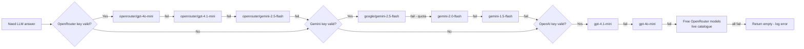

### Portal Configurations

| Portal | Max Steps | Timeout | GPU | CUA | DOM Settle |
|---|---|---|---|---|---|
| Greenhouse | 30 | 300s | No | No | 5000ms |
| Lever | 30 | 300s | No | No | 5000ms |
| Ashby | 30 | 300s | No | No | 5000ms |
| Workday | 40 | 600s | Yes | Yes | 8000ms |
| iCIMS | 35 | 480s | No | Yes | 5000ms |
| SmartRecruiters | 25 | 420s | No | No | 5000ms |
| LinkedIn | 25 | 480s | Yes | No | 5000ms |
| Default | 25 | 420s | No | No | 5000ms |

### Fill Plan Resolution

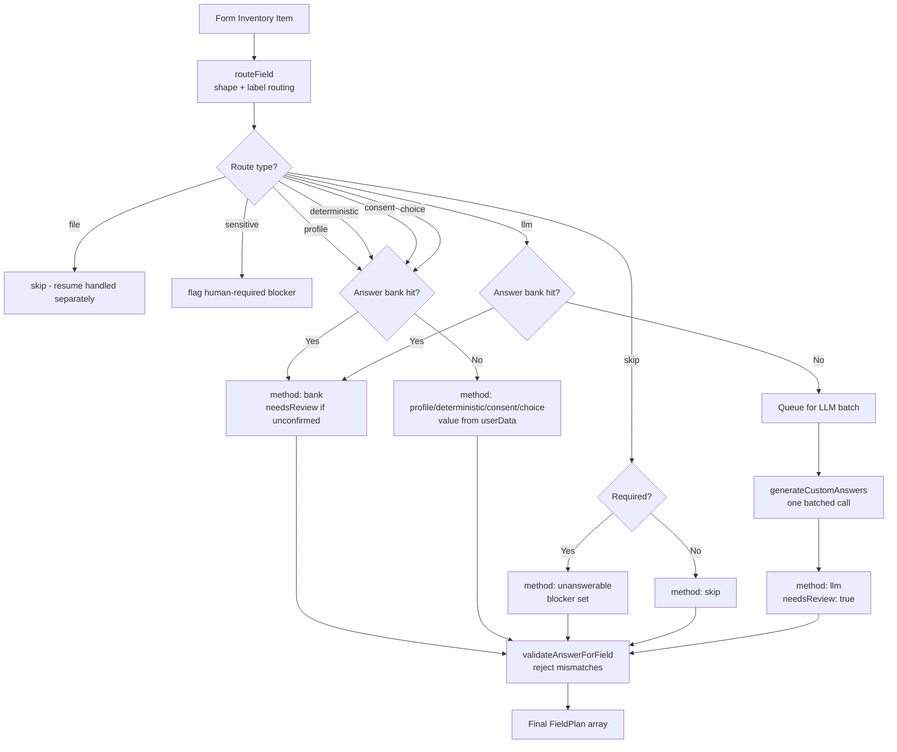

### Automation Providers

The active provider is switchable from the sidebar without redeployment:

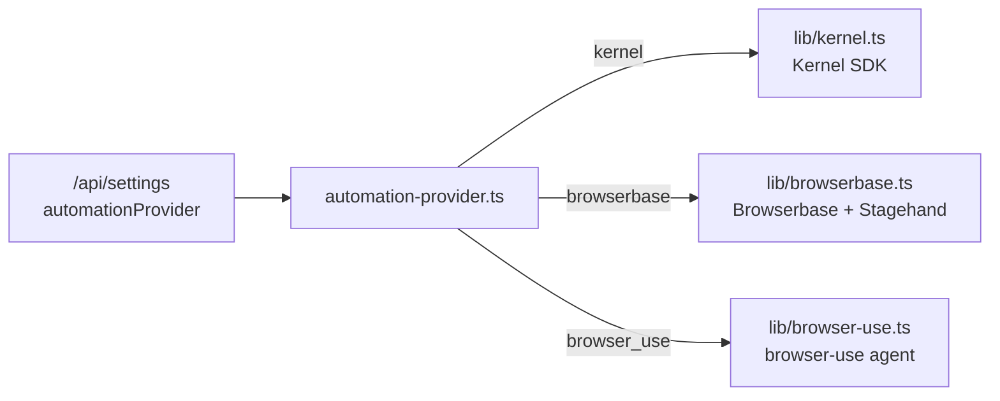

---

## 5. Database Schema

Hosted on Supabase (PostgreSQL). RLS policies enforced on all tables. pg_cron handles scheduled jobs.

### Entity Relationship Diagram

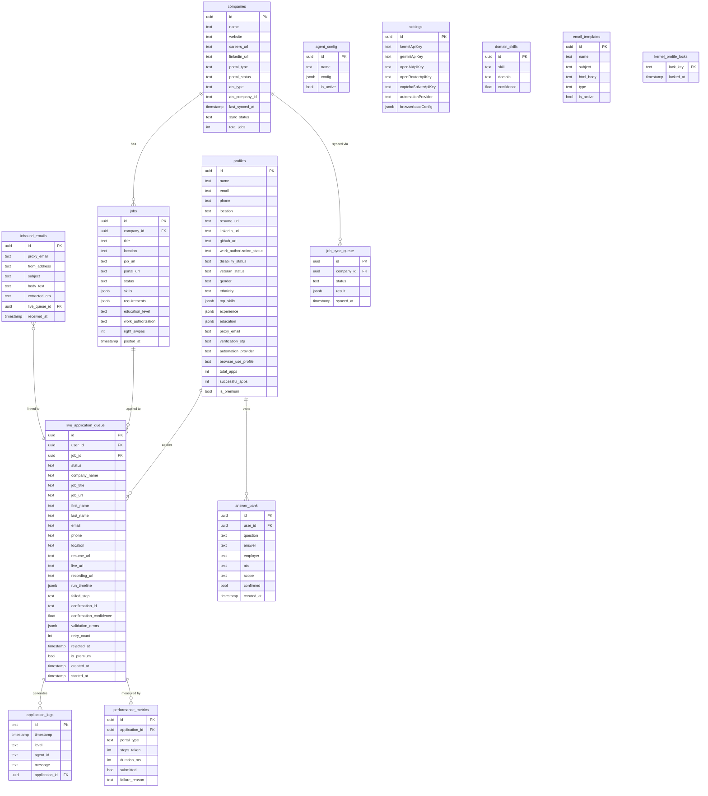

### Key Tables

| Table | Purpose |
|---|---|
| `profiles` | User profiles — all personal data, resume URL, work auth, EEO fields |
| `companies` | Company + ATS portal config, sync status |
| `jobs` | Job listings with skills, requirements, ATS metadata |
| `live_application_queue` | Active/historical runs — status, timeline JSONB, OTP state, confirmation |
| `application_logs` | Per-run structured logs (batched writes, 25 per flush) |
| `agent_config` | Per-agent configuration |
| `performance_metrics` | Agent performance per run |
| `settings` | Global settings — API keys, active provider |
| `answer_bank` | Stored answers scoped by employer/ATS, reused across runs |
| `domain_skills` | Skill-to-domain classification for answer routing |
| `email_templates` | Transactional + campaign templates |
| `inbound_emails` | Proxy email inbox for OTP capture |
| `job_sync_queue` | ATS sync jobs processed by pg_cron |
| `kernel_profile_locks` | Distributed lock preventing concurrent browser profile writes |

---

## 6. Email System

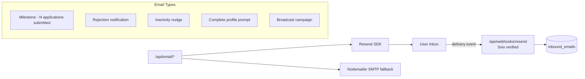

| Email Type | Trigger | Template |
|---|---|---|
| Milestone | N applications submitted | `milestone` |
| Rejection | Application rejected | `rejection` |
| Inactivity | User inactive X days | `inactivity` |
| Complete Profile | Profile incomplete | `complete-profile` |
| Broadcast | Manual operator send | `campaign` |

---

## 7. External Integrations

```mermaid
graph TB
    NQ[NextQuark API]

    NQ -->|browser sessions\nprofiles, telemetry| Kernel[Kernel\n@onkernel/sdk]
    NQ -->|alternative browser\nautomation| Browserbase[Browserbase\n+ Stagehand]
    NQ -->|primary LLM gateway| OpenRouter[OpenRouter\ngpt-4o-mini, gemini-2.5-flash]
    NQ -->|direct LLM fallback| Gemini[Google Gemini\ngemini-2.5-flash]
    NQ -->|direct LLM fallback| OpenAI[OpenAI\ngpt-4.1-mini, gpt-4o-mini]
    NQ -->|CAPTCHA solving| CapSolver[CapSolver\nreCAPTCHA, hCAPTCHA, Turnstile]
    NQ -->|transactional email| Resend[Resend]
    NQ -->|database, auth\nstorage, edge functions| Supabase[Supabase]
    NQ -->|operator alerts| Telegram[Telegram Bot]
    NQ -->|AI tooling endpoint| MCP[MCP Server\nModel Context Protocol]
    NQ -->|webhook verification| Svix[Svix]
```

| Service | SDK / Package | Role |
|---|---|---|
| Kernel | `@onkernel/sdk` | Cloud browser execution, persistent profiles, telemetry stream |
| Browserbase | `@browserbasehq/sdk` + `@browserbasehq/stagehand` | Alternative browser automation |
| OpenRouter | REST API | Primary LLM gateway — GPT-4o-mini, Gemini 2.5 Flash |
| Google Gemini | REST API | Direct LLM fallback |
| OpenAI | REST API | Direct LLM fallback |
| CapSolver | REST API | CAPTCHA solving — reCAPTCHA v2/v3, hCAPTCHA, Turnstile |
| Resend | `resend` | Transactional email delivery |
| Supabase | `@supabase/supabase-js` | Database, auth, file storage, edge functions |
| Telegram | REST API | Webhook notifications to operators |
| MCP | `@modelcontextprotocol/sdk` | Model Context Protocol server |
| Svix | `svix` | Webhook signature verification |

---

## 8. Key Design Patterns

### Batched Log Writes

Logs are queued in-memory and flushed in batches of 25 to avoid per-line DB round-trips on the critical path of a run.

```
logQueue[] → scheduleLogFlush (1200ms debounce) → supabase.insert(batch)
                                                 ↑
                              flushLogs() awaited at run end
```

### Distributed Concurrency Gate

`lib/distributed-gate.ts` + `lib/kernel-limits.ts` enforce per-plan concurrency limits across workers. The Kernel plan's concurrency limit is read once and cached; the gate prevents over-dispatching.

### Circuit Breaker

`lib/circuit-breaker.ts` wraps external service calls. After N consecutive failures the circuit opens and fast-fails subsequent calls for a cooldown period, preventing cascading failures.

### Answer Bank

`lib/answer-bank-store.ts` persists answers to custom questions scoped by employer and ATS. On subsequent runs for the same employer, recalled answers skip the LLM call entirely.

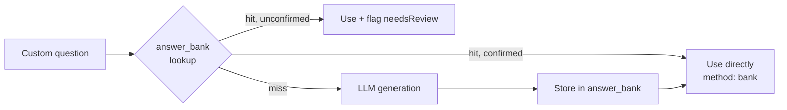

### Honeypot Detection

`lib/honeypot.ts` inspects each form control's geometry and CSS before it enters the fill plan. Off-canvas, zero-opacity, or overflow-clipped fields are excluded — filling them is a reliable bot signal.

### Fill Plan (Resolve-then-Execute)

All answers are resolved into a `FieldPlan[]` before the browser is touched. The fill loop is pure execution with no mid-fill reasoning. This separates the "what to answer" problem from the "how to interact" problem.

### Handler Dispatch

`lib/field-handlers/` provides typed, unit-tested handlers per widget type. `selectHandler(descriptor)` picks the right one; `buildHandlerProgram` generates the VM code. No monolithic fill function.

| Handler | Widget types |
|---|---|
| `text.ts` | `input[type=text]`, `textarea` |
| `dropdown.ts` | `select`, custom listbox |
| `radio.ts` | `input[type=radio]`, `role=radiogroup` |
| `checkbox.ts` | `input[type=checkbox]` |
| `typeahead.ts` | `role=combobox`, autocomplete inputs |
| `buttongroup.ts` | Ashby-style `aria-pressed` button rows |
| `date.ts` | `input[type=date]`, date pickers |

---

## 9. Data Flow Diagrams

### End-to-End Application Submission

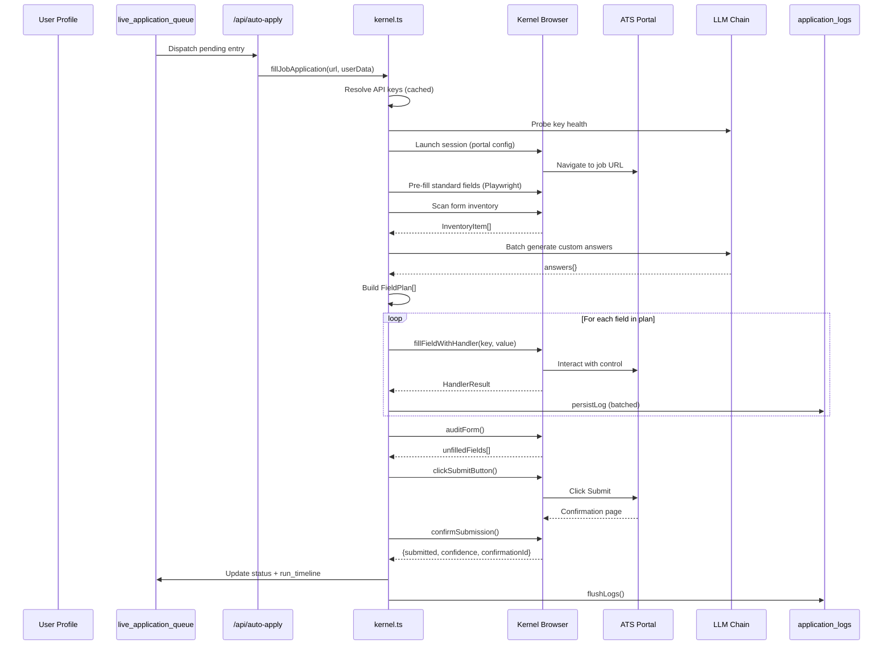

### ATS Sync Flow

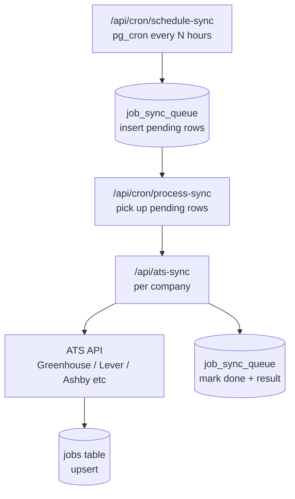

### OTP Handling Flow

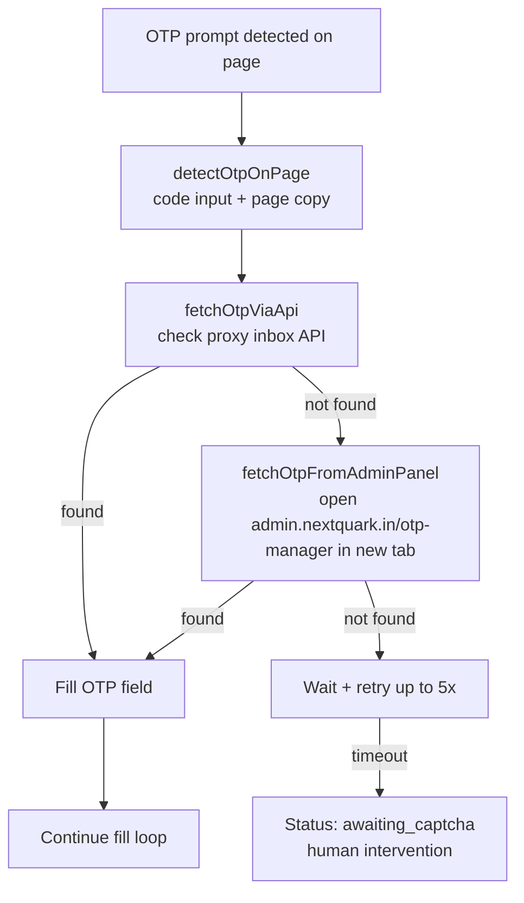

### Email Lifecycle

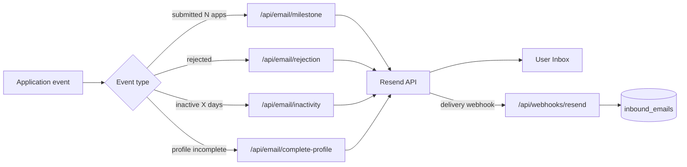

---

*Generated from source: `/Users/adityasurana7/Desktop/nextquark-dashboard`*
